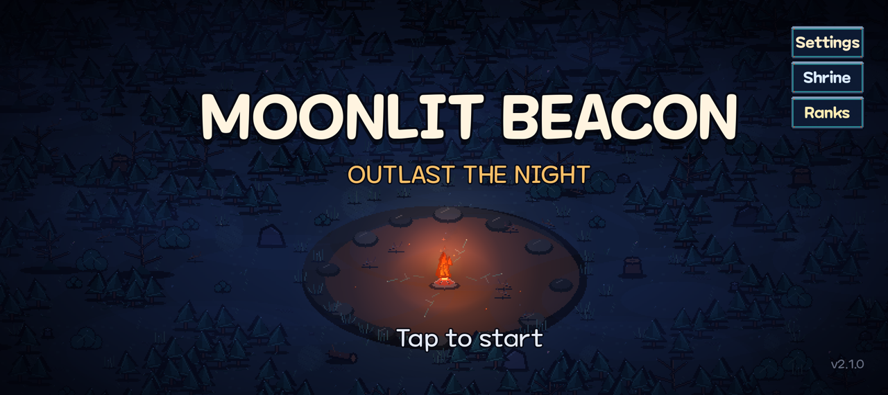
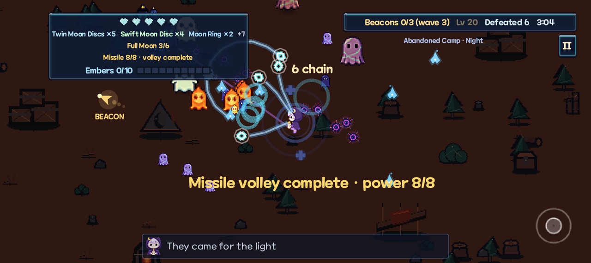
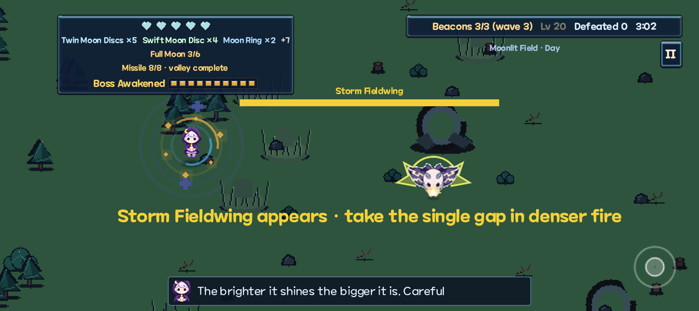

# Moonlit Beacon

> A 2D top-down survivor. Light the beacons in forest, field, and camp, then
> grow three weapon paths from spirit embers and relics and take on the
> guardians — and the next, harder cycle.



| Moonlight barrage | Storm Fieldwing |
| --- | --- |
|  |  |

This repository is **open source (MIT)** and has one purpose: a real game
you can play, and the course that builds it, in the same place. It is a
**shipping Godot 4.7 game** on Google Play and the App Store, a 16-lesson
course that follows the official Godot intro sequence without cloning
`Dodge the Creeps!`, and a public example of
[godot-iap](https://github.com/hyodotdev/openiap/tree/main/libraries/godot-iap)
with [IAPKit](https://kit.openiap.dev) purchase verification.

Clone it, run it, read the course alongside the code it produced, and send
improvements back: contributions are welcome
([CONTRIBUTING.md](CONTRIBUTING.md)).

Docs site: **https://hyodotdev.github.io/MoonlitBeacon/**
(auto-deploys when `apps/docs/` changes land on `main`)

| | |
| --- | --- |
| Engine | Godot **4.7.1 Standard**, GDScript, Compatibility renderer |
| Internal resolution | **808 × 360** landscape (`orientation=4`) |
| Stretch | `canvas_items` + `expand`, nearest-neighbor filter |
| Reference device | Pixel 10 — 2424 × 1080 landscape, arm64-v8a |
| Controls | Full-screen floating move stick, auto-attack, dash button |
| IAP | **godot-iap 3.5.1** + IAPKit (publishable key at export time) |
| Application id | `com.crossplatformkorea.moonlitbeacon` |
| Version | **2.1.0** (both stores live) |
| License | MIT code; third-party credits below |

808 × 360 is exactly one third of the Pixel 10 landscape panel, so 16 px pixel
art scales by an integer 3×. Aspect is `expand`, not `keep`, so extra width
becomes extra view instead of letterbox.

Windows / Web are out of the current ship scope. Desktop runs are for
development. `pointing/emulate_touch_from_mouse=true` lets the virtual stick
work with a mouse.

## godot-iap example

Store purchases go through the official OpenIAP Godot addon, not a bespoke
billing bridge.

- Plugin: `apps/game/addons/godot-iap/` from
  [`godot-iap-3.5.1`](https://github.com/hyodotdev/openiap/releases/tag/godot-iap-3.5.1)
- Game adapter: `apps/game/scripts/iap/`
- Server verification: IAPKit (`openiap-kit_pk_…` publishable key only;
  admin/secret keys never enter the app)
- Android remote dependency: `io.github.hyochan.openiap:openiap-google:3.5.2`
- Direct-distribution APKs (itch.io) skip the native store singleton via
  `OS.has_feature("direct_distribution")`

The project patch on top of the official zip is small and documented in
[`vendor/godot-iap/README.md`](vendor/godot-iap/README.md).
`pnpm test:godot-iap-vendor` checks that it reverses to the official bytes.

See also [Monetize](apps/docs/docs/monetize.md) and
[IAP store setup](notes/release/iap-store-setup.md).

## Layout

```text
MoonlitBeacon/
  docs/              # maintainer art/audit notes (not the published site)
  apps/
    game/            # Godot project (res://)
    docs/            # Docusaurus (GitHub Pages)
      docs/          # reference
      course/        # Lesson 1 … Lesson 16
  notes/             # maintainer plans, scripts, capture pipeline
  vendor/godot-iap*  # official zip provenance + Moonlit patch
  stores/            # store listing images
  _downloads/        # original asset ZIPs (gitignored)
  _asset_sources/    # unpacked originals (gitignored)
  builds/            # export and capture output (gitignored)
```

Original asset packs stay outside `res://`. Only the files the game uses are
copied into `apps/game/assets/third_party/` and listed in the
[asset manifest](apps/docs/docs/assets/manifest.md).

## Run the game

1. Install [Godot 4.7.1 Standard](https://godotengine.org/download).
2. Clone this repository.
3. Follow the [asset download guide](apps/docs/docs/assets/download-guide.md)
   if you are rebuilding art from upstream packs. The in-tree `assets/` copy is
   already the used subset.
4. Open `apps/game/project.godot`.

```bash
pnpm game          # run
pnpm game:editor   # editor
pnpm game:check    # headless open/quit
pnpm verify        # CI-equivalent checks
```

`scripts/godot.mjs` finds Godot on PATH or in common install locations.
Set `GODOT_BIN` if it cannot.

## Android

```bash
pnpm android:build
pnpm android:run
```

Do not call `godot --export-debug "Android"` yourself. `android:build`
installs the export template, isolates Play Billing from the direct-distribution
APK, and cleans Gradle leftovers.

`am start -n …/com.godot.game.GodotApp` fails (`exported=false`).
`android:run` launches with `monkey` against
`com.crossplatformkorea.moonlitbeacon`.

| | |
| --- | --- |
| Application id | `com.crossplatformkorea.moonlitbeacon` |
| Arch | arm64-v8a |
| Preset | `Android` in `apps/game/export_presets.cfg` |

`pnpm android:bundle` writes a Play AAB with Billing + IAPKit. The key comes
from `IAPKIT_API_KEY` or the macOS Keychain. The generated `iapkit.cfg` is
deleted after export and is gitignored.

## iOS

Physical devices only. The Godot 4.7.1 iOS template has no arm64 simulator
slice, and Apple Silicon simulator OpenGL ES is broken on current runtimes.

```bash
pnpm ios:devices
pnpm ios:run
```

## Docs site

Node 20+ and pnpm:

```bash
pnpm install
pnpm docs:dev
pnpm docs:build
```

| Doc | |
| --- | --- |
| [Intro](apps/docs/docs/intro.md) | overview and how to run |
| [The game](apps/docs/docs/game.md) | scope, rules, scoring |
| [Assets](apps/docs/docs/assets/download-guide.md) | download and license check |
| [Third-party](apps/docs/docs/assets/third-party.md) | art, audio, godot-iap |
| [Monetize](apps/docs/docs/monetize.md) | IAP products and verification |

License text copies live in
[`apps/game/docs/licenses/`](apps/game/docs/licenses/).

## Lessons

Course pages: [`apps/docs/course/`](apps/docs/course/).
Maintainer plans, recording scripts, and the capture pipeline stay in
[`notes/`](notes/) and are not published on the docs site.

Each lesson ships function, art, sound, and UI together so a paused lesson
still looks like a store screenshot.

| Lesson | You learn | On screen |
| --- | --- | --- |
| 1 | Project setup, assets, title | Night-forest diorama, title, tap-to-start |
| 2 | Nodes and scenes | One beacon burning in the clearing |
| 3 | Instances | Three beacons in the arena |
| 4 | First script | Beacons ignite in sequence |
| 5 | Player scene | Four-direction idle |
| 6 | Input | Floating stick walk |
| 7 | Signals | 1.3 s ignite ring |
| 8 | Enemies | Forest spirits chase |
| 9 | Main loop | Moon gate and victory |
| 10 | HUD | Hearts, time, beacons |
| 11 | 0.1.0 on device | Playable on Pixel 10 |
| 12 | Dash | Dash button and afterimage |
| 13 | Three spirits + guardian | Music swap, guardian entrance |
| 14 | Score and ranks | Result panel |
| 15 | Settings, locales, credits | Live language switch |
| 16 | QA and 1.0.0 | Signed APK path |

The course stops at 1.0.0. The tree continues through store release 2.1.0.

## Credits

```text
Engine
  Godot Engine 4.7.1 — MIT License

Art and UI
  Moonlit Beacon — Original assets

Music and sound
  Ninja Adventure Asset Pack — Pixel-Boy and AAA — CC0
  Kenney UI Audio — Kenney — CC0

Font
  Maplestory — ⓒ NEXON Korea
  Noto Sans CJK SC — Google — SIL Open Font License 1.1

Store SDK
  godot-iap 3.5.1 — OpenIAP contributors — MIT License

Made by
  Hyo Dev
```

See [third-party assets](apps/docs/docs/assets/third-party.md).
Game code is [MIT](LICENSE). Contributions: [CONTRIBUTING.md](CONTRIBUTING.md).
